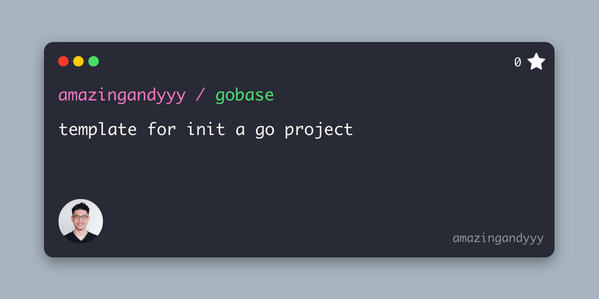

<p styles="font-size: 20rem" align="center">
    
</p>
<h1 align="center">
__REPO_NAME__
</h1>
<h4 align="center">
title
</h4>
<p align="center">
sub title
</p>

## Installation

It's easy!

```sh
bash <(curl -sL https://raw.githubusercontent.com/amazingandyyy/__REPO_NAME__/main/scripts/install.sh)
```

## Preparation

- [Generate a Github personal access token](https://github.com/settings/tokens/new?scopes=repo&description=__REPO_NAME__-cli)
  - [repo] scrope
  - [no expiration]

## Usage

```
# get instructions
__REPO_NAME__ -help

# regex mode
__REPO_NAME__ -owner amazingandyyy -search ".*-deployments$" -output ./code
# wildcard mode
__REPO_NAME__ -owner amazingandyyy -search "*-deployments" -mode wildcard -output ./projects

# interactive mode
__REPO_NAME__
```

## Development

### Initialization

```sh
git clone https://github.com/amazingandyyy/__REPO_NAME__.git
cd __REPO_NAME__
./script/setup.sh
```

### Trigger pre-commit hook manually

```sh
pre-commit run --all-files
```

---



## Contribution

- Try out this tool
- Star this repo
- Share with your friend!
- [Create issue](https://github.com/amazingandyyy/__REPO_NAME__/issues/new)
- Create PRs

## Resources

- [regex101](http://regex101.com)
- wildcard

## LICENSE

[MIT](LICENSE)
